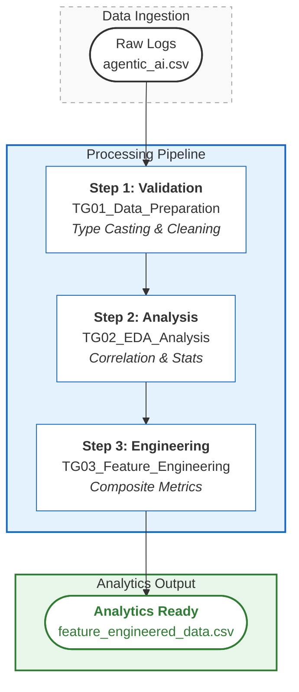

# Agentic Cost-Performance Analysis

**Course:** DATA 230 - Data Visualization | San José State University

**Focus:** AI Performance Metrics, Cost Optimization, and Feature Engineering

---

## Abstract

This project analyzes the trade-offs between performance, cost, and latency in AI agent architectures. By processing 5,000 execution logs, this study quantifies the relationship between resource consumption (CPU/Memory) and task success rates across various deployment environments (e.g., Edge, Cloud). The primary objective is to prepare a high-quality, feature-engineered dataset suitable for predictive modeling of agent efficiency and subsequent visualization in Tableau.

---

## Data Pipeline

The project implements a sequential data processing pipeline designed to transform raw execution logs into analytical features.



---

## Repository Structure

```
agentic-cost-performance-analysis/
├── TG01_Data_Preparation.ipynb      # ETL: Cleaning, type casting, and validation
├── TG02_EDA_Analysis.ipynb          # Analytics: Correlation matrices and distribution analysis
├── TG03_Feature_Engineering.ipynb   # Transformation: Composite metric creation
├── requirements.txt                 # Dependency specification
├── README.md                        # Project documentation
└── data/
    ├── raw/                         # Original dataset (5,000 records)
    ├── cleaned/                     # Validated dataset (Null/Duplicate free)
    └── analytics/                   # Final feature-engineered dataset (37 columns)
```

---

## Methodology

### 1. Data Cleaning & Validation

**Notebook:** TG01_Data_Preparation.ipynb

The initial phase focused on data integrity. The raw dataset (agentic_ai.csv) underwent:

- **Type Casting:** Ensuring numerical precision for cost metrics (float64) and categorical encoding for agent types.
- **Sanity Checks:** Validating logical constraints (e.g., success_rate ∈ [0,1]).
- **Duplicate Removal:** Verified zero row duplication to ensure statistical independence of samples.

### 2. Exploratory Data Analysis (EDA)

**Notebook:** TG02_EDA_Analysis.ipynb

Investigated the underlying distributions and correlations within the dataset. Key analytical steps included:

- **Correlation Mapping:** Identified collinearity between execution_time and cost_per_task (r ≈ 0.99).
- **Distribution Analysis:** Analyzed the skewness of response_latency_ms across different model architectures.
- **Multivariate Analysis:** Examined the interaction effects between deployment_environment and efficiency_score.

### 3. Feature Engineering

**Notebook:** TG03_Feature_Engineering.ipynb

To prepare the data for machine learning, 11 new synthetic features were derived to capture complex non-linear relationships:

**Composite Metrics:**
- `overall_performance_score`: Weighted average of success, accuracy, and efficiency.
- `cost_effectiveness`: Ratio of performance index to financial cost.

**Interaction Features:**
- `complexity_autonomy_ratio`: Measures agent autonomy relative to task difficulty.
- `success_autonomy_interaction`: Captures the compounding effect of autonomy on success rates.

**Temporal Features:**
- Extracted `hour_of_day` and `is_weekend` flags to account for temporal load variations.

---

## Key Findings

- **Cost-Latency Linearity:** There is a near-perfect linear relationship between execution time and cost, suggesting that latency reduction is the single most effective lever for cost optimization.

- **Diminishing Returns:** Higher resource consumption (CPU/Memory) correlates negatively with efficiency scores (r < -0.8), indicating that "heavier" models do not necessarily yield proportional performance gains for all task categories.

- **Architectural Efficiency:** Lighter model architectures consistently demonstrated superior performance-per-cost ratios compared to larger legacy models in low-complexity tasks.

---

## Data Dictionary

### Primary Metrics

| Feature | Type | Description |
|---------|------|-------------|
| `success_rate` | Float | Probability of successful task completion (0.0 - 1.0) |
| `performance_index` | Float | Composite score derived from accuracy and speed |
| `cost_per_task_cents` | Float | Financial cost per execution unit ($0.003 - $0.059) |
| `execution_time_seconds` | Float | Total runtime duration (1s - 157s) |

### Categorical Dimensions

| Feature | Description |
|---------|-------------|
| `agent_type` | Functional role (e.g., "Code Assistant", "Data Analyst") |
| `model_architecture` | Underlying LLM backbone (e.g., "GPT-4o", "LLaMA-3") |
| `deployment_environment` | Infrastructure context (e.g., "Edge", "Cloud", "Hybrid") |

---

## Setup & Usage

### Prerequisites

- Python 3.8+
- JupyterLab or VS Code

### Installation

```bash
pip install -r requirements.txt
```

### Reproducibility

The notebooks are sequential. For a complete replication of the dataset:

1. Run TG01 to generate `data/cleaned/cleaned_data.csv`.
2. Run TG02 to generate statistical outputs.
3. Run TG03 to generate `data/analytics/feature_engineered_data.csv`.

---

**Built for DATA 230 at San José State University**
